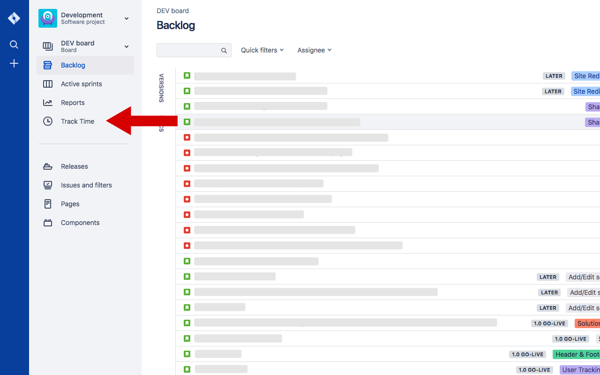

# Harvest Jira Plugin

Adds a Harvest time tracking button to JIRA issues.  No synchronization to jira is done, all data stays in harvest.

# Why
The [official harvest-jira integration](https://www.getharvest.com/apps-and-integrations/jira) is done via a [jira plugin](https://marketplace.atlassian.com/apps/1211628/harvest-time-tracking-official?hosting=cloud&tab=reviews) - which might not be possible or desirable in some cases (for example you don't have an admin account on your client's jira instance).

# Screenshot

