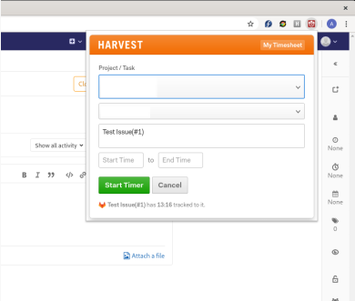

# Harvest Issue Board Plugin

This extension adds a Harvest time tracking button for JIRA, ZAMMAD and GITLAB issues (active sprints page, issue page). No synchronization to the webpage is done, all data stays in Harvest.
 
 * [Chrome Store](https://chrome.google.com/webstore/detail/jira-harvest-time-trackin/klgljijecjfkdfobihclllkadmoeokgg)
 * [Mozilla Addons](https://addons.mozilla.org/de/firefox/addon/jira-harvest-helper)

# How
Select the ticket, then click on the extension icon in the upper right corner. A popup will open where you can specify project and task and set the desired starting time (which defaults to now). A permanent link to the selected issue will be added to the harvest item automatically.

# Screenshot

